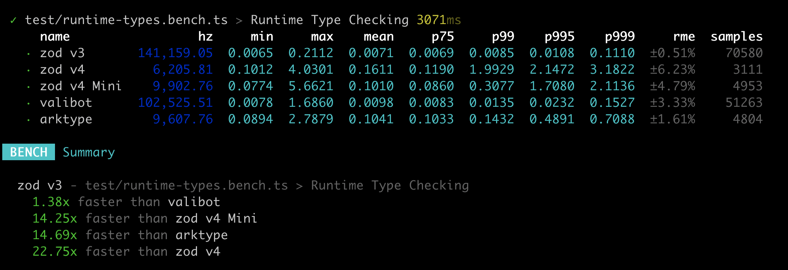

# TypeScript Runtime Type Libraries Benchmarks

A comparison of popular TypeScript runtime validation libraries.

## Why?

Because [bundlejs.com](<[bundlejs.com](https://bundlejs.com/)>) didn't mange to
properly extract the actual bundle size of some of the libraries usage.

Also, I was not convinced by some other comparisons online and wanted to compare
popular solutions and their variations based on several criteria:

- Runtime performance
- Actual bundle size for a typical usage
- Development experience

## Results

### Runtime Performance



**Note:**

> It's not clear at the moment why v4 drops in performance.  
> Perhaps something to do with the bundle importing.

### Bundle Size

| Package               | Actual Bundle Size | bundlejs size                                                                                                                                                                                                                                                                                                                                                                                                                                                                                                                                                                                                                                                                                                                                                                                                                                                                                                                                                                                                                                                                                                                                             | Runtime Performance  | Docs | DX                      |
| --------------------- | ------------------ | --------------------------------------------------------------------------------------------------------------------------------------------------------------------------------------------------------------------------------------------------------------------------------------------------------------------------------------------------------------------------------------------------------------------------------------------------------------------------------------------------------------------------------------------------------------------------------------------------------------------------------------------------------------------------------------------------------------------------------------------------------------------------------------------------------------------------------------------------------------------------------------------------------------------------------------------------------------------------------------------------------------------------------------------------------------------------------------------------------------------------------------------------------- | -------------------- | ---- | ----------------------- |
| Zod v3                | 14.88 kB (gzip)    | [14.4 kB (gzip)](https://bundlejs.com/?q=zod%403.25.67&treeshake=%5B%7B+z+%7D%5D&share=MYewdgzgLgBGCmB3AKgS2Aa3gJxgXhgG8AoGGKdLbALhgHIBBBgBQBk6AaYgXwG5jQkWAhTYAhpDHAK4fEVIxoITAEkAJrToBGTgogALMdngRNWgAzndZAA7Z08TQFYAzC4B0b6%2BXGTpqcAARMShHegAmc3CtAFpzWPjdPmIBcGgYMTU1AGUoZQwAMRBsAFts4H14ErE5AC93EAAjACt4aQAKEjIKTBxaeuh7MABzdoBKdxLUMHatDnpkEBBFfWKoOgnqgA92yPm6ReWAG3Bhja5uMf5BdMy1ZF8IKRkwItLyyuq6hpa2qE69HlVBoYPVQDhgPB3GAAK4lRo4cbuGwgCCoCgAN3g4y4ZAMRhM-Xc4OwkOhcIR2CRUxmWjGuJgdgcRJJZNh8MRExRaMx2PpCigj2eATAwVCRMG01G-Mu-FSQnIlBwACUTDCjrACHdcvk3mUKlUxO4ngAzeDMIwQbEiNC9bBXFKoE0wdo9KiqiDqqDGmHASEQCBjeRkAD0IZgJiO0ygMTUqCejSO8BiCC2MajCBgAAEoABPGwmYD2GwxyPRkNgEAxGGwq1qGLwLZ2ExotICpXYD1e9xqEJifjcCNHK3BmBhiMQDMxuMJpMpxvp6bwOBVm4gJMKNdJ9wnUZulVqjXuHDYYoO7gpG6wO4PCRPfzgLsa-AKG9Ch%2BvYr6z5G03my3Wkgt5%2BC8DrEE6LpvnewqPoe3qen6LZBl0Y7hmWYDTvGYiJsmqaLpmOb5oWxalpO5aVtWtbwPWjbNgGIoQK%2BWTAfeLxPt6vZQP2PBDiOKHjuhmGzrhC4xBmy4UVu8Cbmk65Qru7RQSBIrsce2CnvaA5AA)                                                                                                                                                                           | Fastest              | Ok   | Good                    |
| Zod v4                | 14.46 kB (gzip)    | [46.8 kB (gzip)](https://bundlejs.com/?q=zod%403.25.67%2Fv4&treeshake=%5B%7B+z+%7D%5D&share=MYewdgzgLgBGCmB3AKgS2Aa3gJxgXhgG8AoGGKdLbALhgHIBBBgBQBk6AaYgXwG5jQkWAhTYAhpDHAK4fEVIxoITAEkAJrToBGTgogALMdngRNWgAzndZAA7Z08TQFYAzC4B0b6%2BXGTpqcAARMShHegAmc3CtAFpzWPjdPmIBcGgYMTU1AGUoZQwAMRBsAFts4H14ErE5AC93EAAjACt4aQAKEjIKTBxaeuh7MABzdoBKdxLUMHatDnpkEBBFfWKoOgnqgA92yPm6ReWAG3Bhja5uMf5BdMy1ZF8IKRkwItLyyuq6hpa2qE69HlVBoYPVQDhgPB3GAAK4lRo4cbuGwgCCoCgAN3g4y4ZAMRhM-Xc4OwkOhcIR2CRUxmWjGuJgdgcRJJZNh8MRExRaMx2PpCigj2eATAwVCRMG01G-Mu-FSQnIlBwACUTDCjrACHdcvk3mUKlUxO4ngAzeDMIwQbEiNC9bBXFKoE0wdo9KiqiDqqDGmHASEQCBjeRkAD0IZgJiO0ygMTUqCejSO8BiCC2MajCBgAAEoABPGwmYD2GwxyPRkNgEAxGGwq1qGLwLZ2ExotICpXYD1e9xqEJifjcCNHK3BmBhiMQDMxuMJpMpxvp6bwOBVm4gJMKNdJ9wnUZulVqjXuHDYYoO7gpG6wO4PCRPfzgLsa-AKG9Ch%2BvYr6z5G03my3Wkgt5%2BC8DrEE6LpvnewqPoe3qen6LZBl0Y7hmWYDTvGYiJsmqaLpmOb5oWxalpO5aVtWtbwPWjbNgGIoQK%2BWTAfeLxPt6vZQP2PBDiOKHjuhmGzrhC4xBmy4UVu8Cbmk65Qru7RQSBIrsce2CnvaA5AA)                                                                                                                                                                      | Slow for some reason |      |                         |
| Zod v4 Mini           | 5.28 kB (gzip)     | [44.8 kB (gzip)](https://bundlejs.com/?q=zod%403.25.67%2Fv4-mini&treeshake=%5B%7B+z+%7D%5D&share=MYewdgzgLgBGCmB3AKgS2Aa3gJxgXhgG8AoGGKdLbALhgHIBBBgBQBk6AaYgXwG5jQkWAhTYAhpDHAK4fEVIxoITAEkAJrToBGTgogALMdngRNWgAzndZAA7Z08TQFYAzC4B0b6%2BXGTpqcAARMShHegAmc3CtAFpzWPjdPmIBcGgYMTU1AGUoZQwAMRBsAFts4H14ErE5AC93EAAjACt4aQAKEjIKTBxaWoUyd2h7MABzdoBKQZh3CraMdvqS1DBWeHGofXatDnpkEBBFfWKoOkm95bEAD3XN7ci9ugOjgBtwMfOLnkn%2BQXTMmpkL4IFIZGAiqVypVqnUGi02lBOno8qoNDB6qAcMB4O4wABXEqNHBTOaVTBLdw2EAQVAUABu8Cm3zIBiMJn6cxA2NxBKJJMmZIWlJWYFQJUJO0mLJgdgcnKx2BxeMJxOwpPmFPq1NpDKZ0q43RBYICYGCoU5I1WE2%2B3F%2BKX%2BsB6VAASiZ8a9YARAbl8pCyvNqsMxAAzeDMIwQJkiNC9bD24ioEMwdrOnBuiAeqDDfHAHEQCCTeRkAD0JZgJleqygMTUqFBjVe8BiCGuNarCBgAAEoABPGwmYD2Gw1yvVktgEAxfEEqNqGLwa52Ey0tIKNPYDNZ9xqEJifjcCuvKPFmBlisQDs1usNpstxft1bwOBT-4gJsKN9N9zvCYbreeu4ODYMU9rcA6aSwICwISKC-jgABXoZFkMF%2BOC-rQlUYjBmGEbYFG7Qxsa8FgAmSYptBxHgohOZ5iuRZdGe5ZjmA171mIjbNq2j6dj2-aDsOo6XuOk7TrO8Dzouy4FqaEAKJRsEmgh7qAbuUD7jwR4nox54sWxt5cQ%2BMQds%2BolfvAn5pO%2BuK-u0CloaaNHAaBB5AA)                                                                                                          | Slow for some reason |      |                         |
| Valibot               | 1.95 kB (gzip)     | [1.67 kB (gzip)](https://bundlejs.com/?q=valibot%401.1.0&treeshake=%5B%7B+maxLength%2CminLength%2CminValue%2CnotValue%2Cobject%2Cpipe%2CsafeParse%2Cstring%2Ctransform+%7D%5D&share=MYewdgzgLgBGCmB3AKgS2Aa3gJxgXhgG8AoGGKdLbALhgHIBBBgBQBk6AaYgXwG5jQkWAhTYAhpDHAK4fEVIxoITAEkAJrToBGTgogALMdngRNWgAzndZAA7Z08TQFYAzC4B0b6%2BXGTpqcAARMShHegAmc3CtAFpzWPjdPmIBcGgYMTU1AGUoZQwAMRBsAFts4H14ErE5EAAjACt4aQAKEjIKTBxaG1QbeBboezAAcxaASg4YEtQwVnhRqH0WrSm6ZBAQRX1iqDpJ6bEAD3nF5ci1ja2AG3AR-cmecf5BdMy1ZF8IKRkwItLypVqrVGs0oG09HlVBoYL1%2BoMoMMxgdERIIAAzYolFoAOQAriU6jgDmAQFAAGpia54gbmA4zMCU6m08aPMgGIwmHp9AZDWbIqaoyCY0q4glE7D02ZMmkrVlcWz2YBhOG8xH8iaCr4i7H4wnEqakilU2V0qYMmUstk%2BNE-AJgYKhWh80aap78VJCciUHAAJRMeOusAI33R8GYRggA3euXy-zKFSqYkNSDQXUlHtQ6JgLU6VH9EEDUHcheAyogEHG8jIAHoazATNdZlAYmpUN86td4DEEEcW02EDAAAJQACe-QgwHsNhbjebNdJMTxYDxUbUMXgRzsJgg9ogCjzfoDQfcIDxUBs5-43Ab1yj1ZgdYbEAHLbbHa7Pc3-dm8DgIBiV4QC7BQgK7dxbjGQ9sALIt3HbQsTGeHgUleWB3k%2BW1-HAWCgzkUNw0jAYFAwr47XAeNASTBU4FTMjsLALhkOILMc1IrDflw4tS3LSsHyfOcwDfdsxE7btex-QcR3HEwpz6WcX3nRdl1XeB103bcKz3EiskwvxOOPYszwvK8eFve92kfetBOEj9xO-GIBz-RcwPgUC0mA%2BAIJAMZ2P0%2B0uPgisaUra8gA) | Zod is 1.3x faster   | Good | Good                    |
| Valibot with `* as v` | 1.96 kB (gzip)     | [13.4 kB (gzip)](https://bundlejs.com/?q=valibot%401.1.0&treeshake=%5B*+as+v%5D&share=MYewdgzgLgBGCmB3AKgS2Aa3gJxgXhgG8AoGGKdLbALhgHIBBBgBQBk6AaYgXwG5jQkWAhTYAhpDHAK4fEVIxoITAEkAJrToBGTgogALMdngRNWgAzndZAA7Z08TQFYAzC4B0b6%2BXGTpqcAARMShHegAmc3CtAFpzWPjdPmIBcGgYMTU1AGUoZQwAMRBsAFts4H14ErE5ADd3EAAjACt4aQAKEjIKTBxaeptUG3h2%2Buh7MABzdoBKDhh6ktQwVngpqH12rXm6ZBAQRX1iqDo5hfdqgA9V9c3Inb2DgBtwSdO5nhn%2BQXTMtWRfBApDIwEVSuVKtU6g0Wm0oJ09HlVBpzoNhqN3ONltMzvUoICAGbFErtAByAFcSo0cLj3GAQFAAGpiJ7kkbmWlLMDM1nsmYfMgGIwmfruNEjMb47GzeZ4wnEsmU6nYTnLHlsrb8ri2ezAMIDIYSzFSqYy874iQQImlRVUmmyukM9V8h1c53tDkCnyW4EBMDBUKirGmj7cL4pH6wHpUABKJnJT1gBDGYgJ8GYRggIz%2BuXyYLKFSqYnmIjQvRV-GIqAJMHa0ZwcYgCagmPJwD1EAgM3kZAA9L2YCYnssoDE1KggY0nvAYghLqPhwgYAABKAAT2GEGA9hso6HI979Ji5LA5Kzahi8EudhMED9EAU9ewjebDXJUBs7-43EHTyzPZgftBwgRdR3HSdp1nK8F2WeA4BAGIfhAacFCQ6d3BeaYnxfRN3AnJsTHDbgIzSWA-gBH1-HAHCk3OIE0wzbAs3aBRyMBX1wHzCEi21OAkAovwQS4cMqxrdo2MokEaNbdtb27LpAIHfcwDAicxCnGc5xgpdVw3ExtyGPcQIPI8TzPeALyvG9O3vVisgEoEqLAaSQHfT8oG-X9-wUoDlNUiDNOgmJFzgo80PgVC0mQ%2BAMJAaYJMEv1pPwtku2-IA)                                                                     |                      |      |                         |
| ArkType               | 55.82 kB (gzip)    | [45.9 kB (gzip)](https://bundlejs.com/?q=arktype%402.1.20&treeshake=%5B%7B+type+%7D%5D&share=MYewdgzgLgBGCmB3AKgS2Aa3gJxgXhgG8AoGGKdLbALhgHIBBBgBQBk6AaYgXwG5jQkWAhTYAhpDHAK4fEVIxoITAEkAJrToBGTgogALMdngRNWgAzndZAA7Z08TQFYAzC4B0b6%2BXGTpqcAARMShHegAmc3CtAFpzWPjdPmIBcGgYMTU1AGUoZQwAMRBsAFts4H14ErE5KABPG3gAChIyCkwcMxgAHgJoezAAcx6CSKSASn5BdMy1ZF8IKRkwItLyyurahubWmAB6PcU81Q0YEtQwADUxABsAV2bzca4yJRPNfovB9zA7kpx0O4bEYIPBvAdFIZjKYzhdrvdmlpnnooSYPlABt9fv97MAgSCwS99oc7A5aOcrrcHk0nkTScAwnRPkMfn8AXjgdhQd4MRJFv4giFGczvmohRN%2BKkhORKDgAEomO43WAEWa5fKrMoVKpiJoiNAdbCTFKoABmMCa7SoCogStgF2gEgZIHN9Ua7hw2GKEHG8jIEJMNwuUBialQiwARjd4DEEAAPENBhBwEAxaYgaMKdPR9w3ECDS2y7A2u3uW0larYOrG7gweA3UF%2B4l1iBJkNhyPR2PwBMxJPwGAAATdJmA9hsIcDwb2YFTd1%2BoLUMR7dhMEACkAUVvliuV-G4KWmsFm8z5Sw3JeVchPC3P4E16x1eqQp78y2NxDNFpvZ4FYEv9pCE68AuuQ2wetgXpcr6uwBq2wahuGYhRjG8aJhcA6zmmaQZvAWY4TmeYFj%2Bb4XruUBln8lbVvudYNgOsGHFOYDtkhKHdr2-ZDiOEBjqgE7LvBLEznOC7wEuK7QuuaQKCR-LLAB%2B5AA)                                                                                                                                                                              | Zod is 15x faster    | Good | Weird, need extra tools |

## Development

```shell
pnpm i
```

To see the benchmark results:

```shell
pnpm run bench
```

To see the bundle size results:

```shell
pnpm run build
```

## Related Projects

- [typescript-runtime-type-benchmarks](https://github.com/moltar/typescript-runtime-type-benchmarks)
